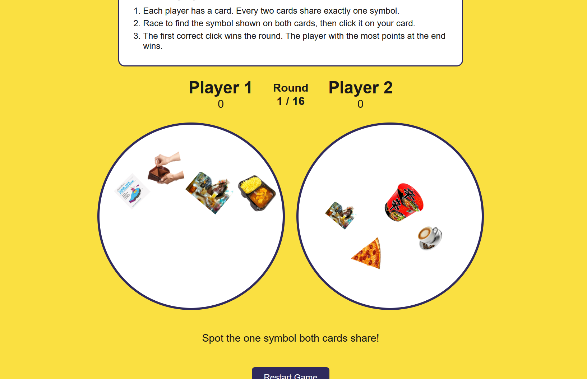

# Computing 2 Coursework Submission.
**CID**: 02568722

A two player Dobble game web app.

This is a student twist on Dobble. The symbols are all things from student life,
like instant noodles, an energy drink, an empty wallet, a pint glass, and a
late night coffee.

Each player has a card. Every two cards share exactly one symbol, and the
players race to spot it and click it. The first correct click wins the round,
and whoever wins the most rounds wins the game.

**Declaration of AI use**

In line with the module's policy permitting AI use where it is referenced,
I used Google Gemini to assist with this project.